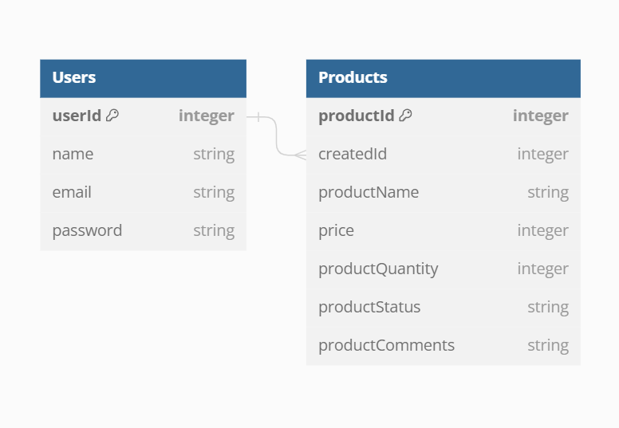

# 환경변수

- JWT_KEY

- DB_HOST
- DB_USER
- DB_PASSWORD
- DB_NAME
- DB_TYPE

- DB_PASSWORD_SALT_ROUNDS
- PORT

# API 명세서 URL

- https://docs.google.com/spreadsheets/d/1P1woqeGA-DHvjo_lDGmJCgJqr32BKIZOILXwpGbA0TA/edit?usp=sharing

# ERD URL



# 더 고민해 보기

## 1. **암호화 방식**

- 비밀번호를 DB에 저장할 때 Hash를 이용했는데, Hash는 단방향 암호화와 양방향
  암호화 중 어떤 암호화 방식에 해당할까요?

  단방향 암호화

- 비밀번호를 그냥 저장하지 않고 Hash 한 값을 저장 했을 때의 좋은 점은
  무엇인가요?

  단방향 암호화는 복호화를 할 수 없어서 보안성이 높습니다

## 2. **인증 방식**

- JWT(Json Web Token)을 이용해 인증 기능을 했는데, 만약 Access Token이

  - 노출되었을 경우 발생할 수 있는 문제점은 무엇일까요? JWT를 탈취한 사용자가
    서버에 인증을 해도 서버는 이 사용자가 탈취한 사용자인지 정당한 사용자인지
    구분할 수 있는 방법이 없습니다.

- 해당 문제점을 보완하기 위한 방법으로는 어떤 것이 있을까요?
  - 토큰이 탈취되면 큰일입니다. 큰일나니까 Access Token에는 만료기간을
    설정합니다. 만료가 되면 Refresh Token으로 AccessToken을 서버로 부터 재발급
    받습니다. 이러한 방법으로 좀 더 안전하게 운영할 수 있습니다.

## 3. **인증과 인가**

- 인증과 인가가 무엇인지 각각 설명해 주세요.

  - 인증: 사용자를 검증하는 프로세스
  - 인가: 인증된 사용자가 어떠한 자원에 접근할 수 있는지를 확인하는 절차

- 과제에서 구현한 Middleware는 인증에 해당하나요? 인가에 해당하나요? 그 이유도
  알려주세요.
  - 인증에 해당한다. JWT로 사용자를 식별하고, 토큰 만료시간을 검사하는 것은
    사용자를 검증하는 것이기 때문입니다.

## 4. **Http Status Code**

- **400 Bad Request**

  - 요청이 잘못된 경우 사용
  - 값이 입력되지 않았을 때

- **401 Unauthorized**

  - 인증 정보가 부정확한 경우 사용
  - 로그인 시에 유저가 존재하지 않거나 비밀번호가 일치하지 않는 경우, 또는
    토큰이 유효하지 않은 경우

- **419 Authentication Timeout**

  - 인증 토큰의 유효기간이 만료된 경우 사용됩니다.
  - JWT 토큰의 만료 시간이 지났을 때

- **200 OK**
  - 요청이 성공적으로 처리되었을 때 사용
  - 로그인이나 API 요청이 성공적일 떄

## 5. **리팩토링**

- MongoDB, Mongoose를 이용해 구현되었던 코드를 MySQL, Sequelize로 변경하면서,
  많은 코드 변경이 있었나요? 주로 어떤 코드에서 변경이 있었나요?

  - 스키마 정의 하는 부분
  - 메소드

  ```
  mongoose
  Product.findOne({ productId: productId }
  // ...
  });
    sequelize
  Products.findOne({
    where: {
      productId: productId,
    }

  ```

- 만약 이렇게 DB를 변경하는 경우가 또 발생했을 때, 코드 변경을 보다 쉽게 하려면
  어떻게 코드를 작성하면 좋을 지 생각나는 방식이 있나요? 있다면 작성해 주세요.

## 6. **서버 장애 복구**

- 현재는 PM2를 이용해 Express 서버의 구동이 종료 되었을 때에 Express 서버를
  재실행 시켜 장애를 복구하고 있습니다. 만약 단순히 Express 서버가 종료 된 것이
  아니라, AWS EC2 인스턴스(VM, 서버 컴퓨터)가 재시작 된다면, Express 서버는
  재실행되지 않을 겁니다. AWS EC2 인스턴스가 재시작 된 후에도 자동으로 Express
  서버를 실행할 수 있게 하려면 어떤 조치를 취해야 할까요? (Hint: PM2에서
  제공하는 기능 중 하나입니다.)
  - `pm2 startup`

## 7. **개발 환경**

- nodemon은 어떤 역할을 하는 패키지이며, 사용했을 때 어떤 점이 달라졌나요?
  - 코드를 변경 후 서버를 재시작 하지 않아도 저장만 해도 알아서 재시작이 되므로
    편합니다
- npm을 이용해서 패키지를 설치하는 방법은 크게 일반, 글로벌(`--global, -g`),
  개발용(`--save-dev, -D`)으로 3가지가 있습니다. 각각의 차이점을 설명하고,
  nodemon은 어떤 옵션으로 설치해야 될까요?
  - 일반 프로젝트안에서만 패키지를 사용할 때
  - 글로벌 시스템 전체에서 사용 가능한 패키지를 설치할 때
  - 개발용 개발 환경에서만 필요한 패키지를 설치할 때
  - nodemon은 개발 npm `install -D nodemon`
